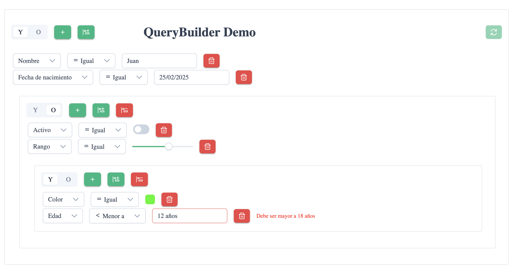

# Angular QueryBuilder


Componente personalizable para construir consultas complejas en Angular 19

## [Demo](https://stackblitz.com/~/github.com/pablo3000/Angular-QueryBuilder)


## 📋 Características

- Construido con Angular 19 Signals para gestión de estado reactivo.
- Implementa completamente ControlValueAccessor para una integración perfecta con formularios.
- Campos, operadores y reglas de validación altamente personalizables.
- Soporte para varios tipos de datos: texto, número, booleano, fecha.
- Grupos de reglas anidables con condiciones AND/OR.
- Soporte para plantillas personalizadas para ampliar los campos de entrada.
- Validación integrada.
- Interfaz de usuario construida con componentes PrimeNG.

## 📷 Captura de pantalla



## 🚀 Instalación

Este es un componente de tipo standalone que puedes integrar directamente en tu proyecto Angular.

### Dependencias

El componente requiere PrimeNG:

```bash
npm install primeng
```

## 📖 Uso

Importa el QueryBuilderComponent en tu módulo o componente independiente:

```typescript
import { QueryBuilderComponent } from './ruta/al/query-builder.component';

@Component({
  // ...
  imports: [QueryBuilderComponent]
})
```

Úsalo en tu plantilla:

```html
<app-query-builder
  [fields]="fields"
  [(ngModel)]="query"
  (valid)="onValidityChange($event)"
  [allowGroups]="true"
></app-query-builder>
```

### Ejemplo de configuración básica

```typescript
import { Component } from '@angular/core';
import { Field, RuleGroup } from './ruta/al/query-builder.component';

@Component({
  selector: 'app-example',
  template: `
    <app-query-builder
      [fields]="fields"
      [(ngModel)]="query"
      (valid)="onValidityChange($event)"
    ></app-query-builder>
  `
})
export class ExampleComponent {
  fields: Field[] = [
    {
      name: 'nombre',
      label: 'Nombre',
      type: 'string'
    },
    {
      name: 'edad',
      label: 'Edad',
      type: 'number',
      valueProps: {
        min: 0,
        max: 120
      }
    },
    {
      name: 'fechaNacimiento',
      label: 'Fecha de Nacimiento',
      type: 'date',
      valueProps: {
        dateFormat: 'dd/mm/yy',
        showTime: false
      }
    },
    {
      name: 'activo',
      label: 'Activo',
      type: 'boolean'
    }
  ];

  query: RuleGroup = {
    condition: 'AND',
    rules: [
      {
        field: 'nombre',
        operator: 'contains',
        value: ''
      }
    ]
  };

  onValidityChange(isValid: boolean) {
    console.log('Consulta válida:', isValid);
  }
}
```

## ⚡ Características avanzadas

### Validadores personalizados

```typescript
fields: Field[] = [
  {
    name: 'email',
    label: 'Correo electrónico',
    type: 'string',
    validators: [
      {
        validate: (value: string) => /^[^\s@]+@[^\s@]+\.[^\s@]+$/.test(value),
        message: 'Por favor, introduce un correo electrónico válido'
      }
    ]
  }
]
```

### Controles personalizados

Puedes crear controles personalizados usando plantillas:

```html
<app-query-builder
  [fields]="fields"
  [(ngModel)]="query">
  <ng-template pTemplate="customRate" let-value let-onChange="onChange" let-disabled="disabled">
    <p-rating
      [ngModel]="value"
      (ngModelChange)="onChange($event)"
      [disabled]="disabled"
      [stars]="5"
      [cancel]="false">
    </p-rating>
  </ng-template>
</app-query-builder>
```

```typescript
fields: Field[] = [
  {
    name: 'pais',
    label: 'País',
    type: 'string',
    customControl: 'customRate',
    initialValue: 3
  }
]
```

## 🎏 Referencia de la API

### Inputs

| Input           | Tipo                       | Por defecto | Descripción                                             |
|-----------------|----------------------------|---------|---------------------------------------------------------|
| fields          | Field[]                    | -       | Array de definiciones de campos                         |
| allowGroups     | boolean                    | true    | Si se permiten grupos de reglas anidados                |
| defaultRule     | Rule                       | -       | Plantilla para nuevas reglas                            |
| disabled        | boolean                    | false   | Deshabilitar todo el control                            |
| showTooltip     | boolean                    | true    | Mostrar tooltips en botones                             |
| customTemplates | QueryList<PrimeTemplate>   | -       | Templates personalizados pasados desde componentes padre|

### Outputs

| Output         | Tipo                 | Descripción                                              |
|----------------|----------------------|----------------------------------------------------------|
| removeRequest  | EventEmitter<void>   | Emitido cuando se debe eliminar un grupo de reglas       |
| valid          | EventEmitter<boolean>| Emitido cuando cambia la validez de la consulta          |

### Modelos

#### Field

```typescript
export interface Field {
  name: string;
  label: string;
  type: 'string' | 'number' | 'boolean' | 'date';
  allowedOperations?: Operator[];
  validators?: Validator[];
  customControl?: any;
  initialValue?: any;
  valueProps?: {
    placeholder?: string;

    min?: number;
    max?: number;
    mask?: string;
    prefix?: string;
    suffix?: string;
    minFractionDigits?: number;
    maxFractionDigits?: number;
    useGrouping?: boolean;
    locale?: string;
    currency?: string;

    dateFormat?: string;
    showTime?: boolean;
    showSeconds?: boolean;
    minDate?: Date;
    maxDate?: Date;
    hourFormat?: string;
  }
}
```

#### Rule

```typescript
export interface Rule {
  field: string;
  operator: string;
  value: any;
  errorMessage?: string;
}
```

#### RuleGroup

```typescript
export interface RuleGroup {
  condition: 'AND' | 'OR';
  rules: (Rule | RuleGroup)[];
}
```

#### Operator

```typescript
export type Operator =
  | 'equal'
  | 'not_equal'
  | 'contains'
  | 'begins_with'
  | 'ends_with'
  | 'less'
  | 'greater'
  | 'between'
  | 'in'
  | 'not_in';
```

#### Validator

```typescript
export interface Validator {
  validate: (value: any) => boolean;
  message: string;
}
```

## 🎨 Iconos

El componente incluye una biblioteca de iconos personalizada para los operadores. Estos están incluidos en la carpeta `Lib-Icon`.

## 🈵 Internacionalización

Actualmente, el componente tiene textos en español codificados. Las versiones futuras admitirán internacionalización completa a través de un proveedor de texto configurable.

## 🎨 Diseño

El componente viene con estilos predeterminados pero puede ser fácilmente personalizado usando CSS. Consulta el archivo SCSS del componente para ver todos los estilos utilizados.

## 👨‍💻 Contribuciones

¡Las contribuciones son bienvenidas! Siéntete libre de hacer un fork del repositorio y enviar pull requests para mejorar el código.

## 💁 Descargo de responsabilidad

Este componente está en versión beta. El código puede no estar optimizado para todos los casos de uso y puede contener errores. Ha sido probado en escenarios básicos pero puede requerir trabajo adicional para aplicaciones empresariales.

## 📝 Licencia

Este proyecto está licenciado bajo la Licencia MIT - consulta el archivo LICENSE para más detalles.

## 👏 Agradecimientos

- Construido con [Angular](https://angular.io/)
- Componentes UI de [PrimeNG](https://primeng.org/)
- Inspirado en [jQuery QueryBuilder](https://querybuilder.js.org/)

